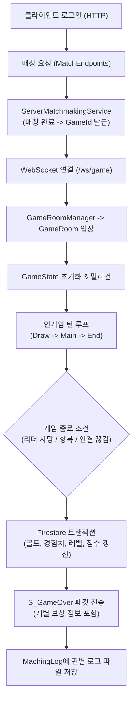

# MyGameServer 프로젝트 파일 구조 및 아키텍처 요약

> **스텔라 듀얼(StellStone) 1:1 대전 카드 게임 서버**  
> 프레임워크: **.NET 10.0 (ASP.NET Core Minimal API + WebSocket)**  
> 백엔드/인프라: **Google Cloud Firestore, Firebase Authentication**

---

## 1. 전체 디렉토리 구조 한눈에 보기

```text
MyGameServer/
├── Program.cs                         # 서버 진입점 (HTTP API 라우팅, 미들웨어, WebSocket 매핑)
├── GameActionModels.cs                # C <-> S 웹소켓 통신 패킷 및 액션/이벤트 Enum 정의
├── GameState.cs                       # 1:1 인게임 핵심 상태 머신 (턴, 전투, 소환, 승패, 보상)
├── GameRoom.cs                        # 게임 방 단위 세션 및 통신 중계 관리
├── GameRoomManager.cs                 # 활성 게임 룸 수명 주기 관리 (생성, 조회, 정리)
├── GamePlayer.cs                      # 플레이어 세션 (Uid, WebSocket, Bot 여부)
├── GameSocketHandler.cs               # 인게임 웹소켓 연결 수립, 토큰 인증, 메시지 루프
├── BotAI.cs                           # 싱글/테스트용 AI 봇의 행동 및 의사결정 알고리즘
├── TargetValidator.cs                 # 카드 사용 및 스킬의 타겟 유효성 검증기
├── ServerCardData.cs                  # 서버 카드 정적 데이터 정의 클래스
├── ServerCardDatabase.cs              # 전체 카드 데이터베이스 로더 및 인메모리 캐시
├── ServerProductDatabase.cs           # 상점 판매 상품 정적 데이터
├── appsettings.json                   # 서버 환경 설정 (포트, Firestore 설정 등)
│
├── Endpoints/                         # Minimal API HTTP 엔드포인트 분리
│   ├── AdminEndpoints.cs             # 관리자용 API (유저 데이터 리셋, 재화 지급 등)
│   ├── AuthEndpoints.cs              # 인증 및 로그인/회원가입 API
│   ├── DeckEndpoints.cs              # 덱 조회, 생성, 수정, 삭제 API
│   ├── GameSocketEndpoints.cs        # 인게임 웹소켓 엔드포인트 매핑 (/ws/game)
│   ├── MatchEndpoints.cs             # 매칭 큐 참가/취소/상태 확인 API
│   └── ShopEndpoints.cs              # 상점 상품 목록 조회 및 구매 API
│
├── Entities/                          # 인게임 런타임 엔티티 모델
│   ├── PlayerState.cs                # 인게임 플레이어 상태 (덱, 손패, 필드, 멤버존, 마나, 리더)
│   ├── GameCard.cs                   # 인게임 카드 인스턴스 (스탯, 비용, 출처, 키워드, 부가 효과)
│   └── GameEntity.cs                 # 필드/멤버존에 배치된 하수인/리더 개체 (체력, 공격력, 위치)
│
├── Effects/                           # 카드 효과 및 이벤트 시스템
│   ├── EventSystem.cs                # 이벤트 브로커 (ON_PLAY, ON_DEATH, ON_SUMMON, ON_DRAW 등)
│   ├── CardEffectSystem.cs           # 카드 효과 실행 엔진 파이프라인
│   ├── GameActionPacket.cs           # 효과 액션 패킷 정의
│   ├── TargetSelector/               # 효과 적용 타겟 필터링 시스템
│   │   └── TargetSelector.cs
│   ├── Conditions/                   # 효과 발동/타겟 조건 검사 클래스들
│   │   ├── HistoryCondition.cs       # 이번 턴/이전 행동 이력 조건
│   │   ├── KeywordCondition.cs       # 키워드 보유 여부 조건
│   │   ├── PropertyCondition.cs      # 종족, 타입 등 속성 조건
│   │   ├── RelationCondition.cs      # 아군/적군/자신/상대 관계 조건
│   │   └── StatCondition.cs          # 체력, 공격력, 비용 등 수치 조건
│   └── Actions/                      # 구체적인 효과 액션 실행 단위
│       ├── AddCardToHandAction.cs    # 손패에 카드 생성/추가 (토큰 창조)
│       ├── BuffAction.cs             # 스탯 버프 부여
│       ├── ConditionalAction.cs      # 조건부 액션 분기
│       ├── CrowdControlAction.cs     # 속박/빙결 등 상태이상 적용
│       ├── DamageAction.cs           # 피해 입히기
│       ├── DestroyAction.cs          # 즉시 처치/소멸
│       ├── DiscardAction.cs          # 손패 카드 버리기
│       ├── DrawAction.cs             # 카드 드로우
│       ├── DynamicStatAction.cs      # 손패 장수/필드 상황 기반 동적 스탯 계산
│       ├── ForceAttackAction.cs      # 강제 공격 실행
│       ├── GainManaAction.cs         # 마나 획득/부스팅
│       ├── HealAction.cs             # 체력 회복
│       ├── ManaModAction.cs          # 카드 비용 증감 조작
│       ├── ReturnEntityAction.cs     # 필드 하수인을 손패로 되돌림 (바운스)
│       └── SummonAction.cs           # 토큰 하수인 필드 특수 소환
│
├── Models/                            # 공용 데이터 모델 및 DTO
│   ├── UserData.cs                   # Firestore 'Users' 컬렉션 문서 매핑 모델
│   ├── DeckData.cs                   # Firestore 덱 데이터 모델 (메인덱, 사이드덱)
│   ├── GameEnums.cs                  # 카드 타입, 등급, 세력 등 공용 Enum
│   ├── GameLogEvent.cs               # 인게임 연출용 이벤트 로그 모델
│   ├── GameServerSettings.cs         # 서버 런타임 설정 모델
│   ├── MatchmakingModels.cs          # 매칭 큐 참가 요청 및 상태 DTO
│   ├── MemberSkill.cs                # 멤버존 캐릭터 스킬 데이터 모델
│   ├── StarterAccountConfig.cs       # 신규 계정 기본 지급 덱/카드/재화 설정
│   └── Requests/                     # HTTP 요청 Request Body DTOs
│       ├── AuthRequests.cs           # 회원가입, 게스트 로그인 등 DTO
│       └── DeckRequests.cs           # 덱 저장/수정 요청 DTO
│
├── Services/                          # 핵심 비즈니스 로직 서비스
│   ├── AuthHelper.cs                 # Firebase 토큰 검증, 신규 계정 초기화, Firestore CRUD
│   └── ServerMatchmakingService.cs   # 대전 매칭 대기열 관리 및 플레이어 매칭 알고리즘
│
├── Shop/                              # 상점 및 상품 구매 시스템
│   ├── ShopDatabase.cs               # 상점 DB 초기 로딩 및 조회
│   ├── ShopModels.cs                 # 상점 패키지, 확률형 아이템, 구매 요청/응답 모델
│   └── ShopService.cs                # 구매 트랜잭션, 카드팩 오픈 확률 계산, 재화 차감
│
├── MachingLog/                        # 판별 상세 대전 로그 (Match.log, Debug.log) 자동 저장 디렉토리
└── document/                          # 프로젝트 개발 및 최적화 로드맵 문서
```

---

## 2. 레이어별 상세 설명

### ① 네트워크 & 세션 레이어
* **`Program.cs`**  
  서버의 진입점으로 Kestrel 웹 서버를 구동하고, CORS 설정, Firebase/Firestore 서비스 주입, Swagger, 그리고 각 Endpoints 모듈을 등록합니다.
* **`GameSocketHandler.cs`**  
  클라이언트가 `/ws/game?token={jwt}&gameId={id}`로 웹소켓 접속 시 토큰을 검증하고, 해당 플레이어를 지정된 `GameRoom`에 입장시킨 후 양방향 메시지 송수신 루프를 실행합니다.
* **`GameRoom.cs` & `GameRoomManager.cs`**  
  방 단위 2인 세션을 관리합니다. 두 플레이어가 모두 입장하면 `GameState`를 생성해 게임을 시작하고, 연결 끊김 감지 및 방 파기 라이프사이클을 담당합니다.

### ② 인게임 로직 레이어
* **`GameState.cs`**  
  게임의 두뇌 역할을 하는 거대 상태 머신입니다.
  * 턴/페이즈 진행 (Mulligan → Standby → Draw → Main → End)
  * 카드 사용, 대상 지정 유효성 검사, 마나 소모
  * 하수인 전투(공격 선언, 반격, 피해 계산, 사망 처리)
  * 영웅 체력 체크를 통한 승패 판정(`CheckGameOverAsync`)
  * 게임 종료 시 Firestore 트랜잭션을 통한 골드/경험치/전적 보상 처리(`EndGameAsync`)
* **`Entities/` (`PlayerState`, `GameCard`, `GameEntity`)**  
  * `PlayerState`: 각 플레이어의 덱(20장), 손패(최대 10장), 필드(5칸), 멤버존(1칸), 사이드덱(5장), 마나 등을 보유.
  * `GameCard`: 개별 카드의 고유 인스턴스 정보 (출처, 현재 비용, 키워드 목록 등).
  * `GameEntity`: 필드나 멤버존에 실체화된 리더/하수인 오브젝트.
* **`BotAI.cs`**  
  AI 대전 또는 연습 모드 시 봇의 마나 상태, 필드 상황을 분석해 카드를 내고 공격 대상을 선택하는 자동화 알고리즘.

### ③ 효과 및 이벤트 시스템 (`Effects/`)
* **`EventSystem.cs`**  
  하스스톤/매직더개더링 스타일의 이벤트 트리거 시스템입니다. 게임 내에서 발생하는 사건(`ON_PLAY`, `ON_DEATH`, `ON_SUMMON`, `ON_DAMAGE`, `ON_DRAW` 등)을 발행하고 리스너에 비동기 전달합니다.
* **`CardEffectSystem.cs`**  
  카드 데이터에 명시된 JSON 효과 문자열을 파싱하여 타겟 조건(`Conditions/`) 검사 후 적절한 액션(`Actions/`)을 실행합니다.
* **`Actions/` & `Conditions/`**  
  단일 책임 원칙에 따라 피해, 회복, 버프, 소환, 드로우, 바운스, 카드 생성 등의 효과가 모듈화되어 있습니다.

### ④ 패킷 규격 (`GameActionModels.cs`)
* 클라이언트(C)와 서버(S) 간 WebSocket JSON 메시지의 표준 프로토콜입니다.
* `GameActionType`: `PLAY_CARD`, `ATTACK`, `END_TURN`, `DRAW_CARD`, `CARD_CREATED`, `GAME_OVER` 등 모든 메시지 종류 식별.
* `S_GameOver`: 게임 종료 시 승자 정보 및 각 플레이어별 획득 재화(골드, 경험치, 레벨업 여부, 점수 변동) 전달.
* `S_CardCreated`: 카드 효과/토큰으로 생성 카드를 얻었을 때 상대방에게 전용 생성 애니메이션을 유도하는 패킷.

### ⑤ 웹 API 및 백엔드 서비스
* **`Services/AuthHelper.cs`**  
  Firebase Auth 토큰 검증, 신규 유저 생성 시 `StarterAccountConfig.cs` 기반 기본 덱/재화 지급.
* **`Services/ServerMatchmakingService.cs`**  
  실시간 매칭 큐를 관리하며, 비슷한 점수대의 유저를 매칭하거나 일정 시간 초과 시 봇 매칭 지원.
* **`Shop/`**  
  Firestore 트랜잭션을 통해 안전하게 재화를 차감하고 카드팩 개봉 확률 테이블에 맞춰 카드를 획득시키는 상점 시스템.

---

## 3. 핵심 게임 플로우 다이어그램



---
*최종 갱신일: 2026-09-19*
